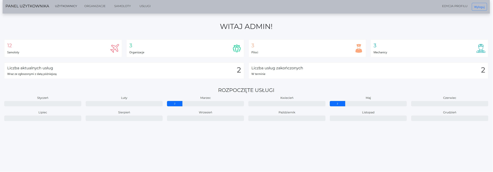
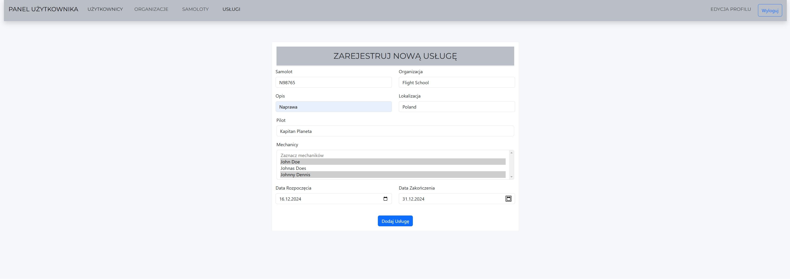
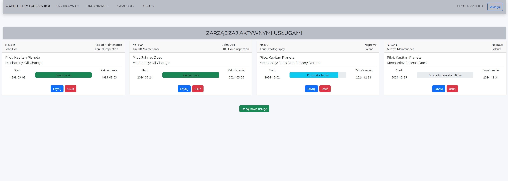

# System zarządzania obsługą hangarową - Hangar-Ops

System zarządzania operacjami w hangarze dla linii lotniczych, umożliwiający rejestrację i śledzenie zadań konserwacyjnych, zarządzanie personelem oraz przeglądanie dostępności zasobów.

## Spis treści

1. Opis projektu
2. Architektura systemu
3. Technologie
4. Moduły systemu
5. Implementacja
6. Interfejs użytkownika
7. Przykładowe zrzuty ekranu

### 1. Opis projektu
Celem projektu Hangar-Ops jest stworzenie aplikacji przy użyciu wzorca MVC, umożliwiającej zarządzanie operacjami w hangarze dla linii lotniczej. Aplikacja pozwala na zarządzanie użytkownikami, organizacjami, samolotami oraz zadaniami konserwacyjnymi. Aplikacja posiada podział na role użytkowników z różnymi uprawnieniami i poziomami dostępu. 

### 2. Architektura systemu

- **Backend:** Java 17, Spring Boot, baza danych H2, biblioteka Lombok.
- **Frontend:** React (JavaScript), komunikacja za pomocą RESTful API.

### 3. Technologie

- **Backend:** Java 17, Spring Boot, Lombok
- **Frontend:** React.js
- **Baza danych:** H2
- **Komunikacja:** REST API (HTTP, JSON)

### 4. Moduły systemu

- Panel logowania użytkownika 
- Zarządzanie użytkownikami
- Zarządzanie organizacjami
- Zarządzanie samolotami
- Zarządzanie zadaniami konserwacyjnymi

### 5. Implementacja

##### Struktura projektu:

- /src/main/java/com/aeh/hangarops - **kod źródłowy backendu**

- /src/main/resources - **zasoby konfiguracyjne**

- /frontend - **kod źródłowy frontendowy**

##### Kluczowe komponenty:

- **Encje:** Mapowanie obiektowe na tabele bazy danych.
- **Repozytoria:** Operacje CRUD na danych.
- **Kontrolery:** Obsługa żądań użytkowników.
- **Widok:** React.js - interfejs użytkownika.

### 6. Interfejs użytkownika
- **Panel użytkownika:** Przegląd operacji, pracowników i zasobów.
- **Zarządzanie użytkownikami:** Dodawanie, edytowanie, usuwanie użytkowników.
- **Zarządzanie organizacjami:** Przegląd i edycja organizacji.
- **Zarządzanie samolotami:** Przegląd i rejestracja nowych samolotów.
- **Zarządzanie usługami:** Tworzenie i zarządzanie zadaniami konserwacyjnymi.

### Przykładowe zrzuty ekranu

**Panel administratora:**  

**Dodanie nowej usługi:**  

**Zarządzanie usługami:**  
